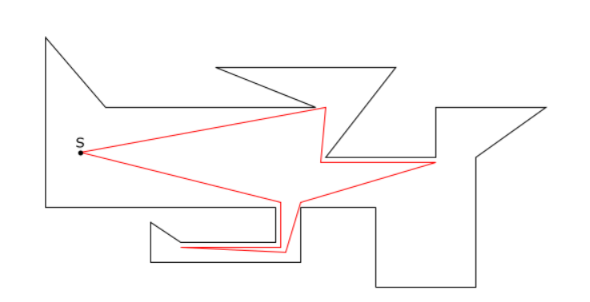

**Notes:** 
- This is a work in progress that should however give you an idea of the structure the project will take. 
- The subject ended up being way more complicated to approach than I expected, hence I spent a lot of time looking for articles and finding "the right one"
- The project is based on the following paper https://www.sciencedirect.com/science/article/pii/S030439750700463X?via%3Dihub, regarding a linear-time 2-approximation algorithm for simple polygons

## Quick Overview
The watchman route problem (WRP) is a problem belonging to the class of art gallery
problems. The problem is the following. Given a simple polygon, we want to find the
shortest route such that any point of the polygon is visible from at least one point of the
route. It ressembles the original art gallery problem in that there are guards and that
we want to watch over the entire surface of the polygon. The resolution of this problem
is tightly related to the touring polygons problem (TPP) and can thus be linked to the
safari and the zookeeper problem that are also very similar.

## The Watchman Route Problem

### Introduction

### Essential Cuts

### Approximated Algorithm

## Interactive example & Code

<iframe src="https://codesandbox.io/embed/triangulation-of-polygons-1dvyl?fontsize=14&hidenavigation=1&theme=dark&view=preview"
     style="width:100%; height:500px; border:0; border-radius: 4px; overflow:hidden;"
     title="Triangulation of polygons"
     allow="accelerometer; ambient-light-sensor; camera; encrypted-media; geolocation; gyroscope; hid; microphone; midi; payment; usb; vr; xr-spatial-tracking"
     sandbox="allow-forms allow-modals allow-popups allow-presentation allow-same-origin allow-scripts"
   ></iframe>
   [Access the code directly](https://codesandbox.io/embed/triangulation-of-polygons-1dvyl?fontsize=14&hidenavigation=1&theme=dark&view=preview)
