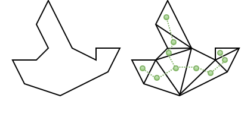

### Abstract

The watchman route problem is an optimization problem related to the famous art gallery problem. The problem is the following.
Given a simple polygon, we want to find the shortest (closed) route such that any point inside the polygon is visible from at least one point of the route.
This report contains all the definitions needed to apprehend the problem, aswell as simple-ish approximation algorithm to find a good solution to the problem.

## Introduction

To better understand the presented problem, let's take a look at the art gallery problem first. The art gallery problem is a visibility problem in computational geometry, that consists in finding the minimum number of guards needed to cover every spot of a polygon (the art gallery). The guards are static and sometimes referred to as cameras.

By replacing the static guards with guards that can move along a line segment, one obtains the art gallery problem with mobile guards. In this variant, the objective is still the same as with the original problem. It however requires a new definition of visibility. When we talked about visibility with static guards, we implicitly meant strong visibility, such that every point of the polygon is visible at all times by one of the guards. This is not required anymore and leads to the definition of weak visibility, for which, every point of the polygon should be visible by at least one point on the line segments of the guards.

If we now allow the guards to move along a closed chain of segments, known as a closed path, and by reducing the number of guards to 1, we obtain the so called Watchman route problem. 

 Figure 1: A watchman route example

## Preliminaries

In this section, we will give some basic terminology and definitions, which will be useful later on.

The polygons we consider in this report are n-sided (n edges) simple (no holes and don't self-intersect) polygons.
They have n edges and n vertices, where n >= 6. This is because simple polygons with n <= 5 sides only need one static guard to solve the problem. Moreover, the polygons shouldn't be starshaped, as there exists, per definition, one point in them from which every other point is visible.

Inside of the polygons, we'll find two kinds of vertices. The ones with an inner angle of less than 180° and those with an inner angle of more than 180°. They are called convex and reflex vertices respectively. Note that a polygon with only convex vertices is called a convex polygon.

A convex hull is defined as the smallest convex set S containing a given shape (e.g. a polygon), where the convex set is a set of points such that for any two points x, y &#8712; S, the segment [x, y] is in the convex set. For convex polygons, the convex hull is equal to the polygon itself. Note that every convex polygon can, again, be guarded by only one static guard.

Tangents, in polygons, are lines or line segments that, locally, only intersect with one point of the polygon. They touch the polygons boundary but dont cross it. They can be inside or outside of the polygon.

Polygon triangulation is the decomposition of polygons into a set of triangles. There can be many triangulatations of a same polygon with more than 3 vertices. Many different triangulation algorithms exist.

## Problem definition

As mentionned before, we will consider the watchman route problem in the case of simple polygons. We will review this problem in the fixed version, for which the route must go through a starting point **s** (a "door") located on the boundary of the polygon. This is opposed to the floating variant, for which no fixed point is specified.

Finding the shortest route for this problem is not trivial, as there can be an infinite number of routes and paths inside a polygon.
An optimal solution was found by xxx in [?] and has a time complexity of O(n^3 log n). Such a complexity is not ideal in practical, hence it is of interest to find a linear time approximation algorithm. In [?], xxx presents a 2-approximation linear time algorithm to solve the watchman route problem, meaning that the solution is at most 2 times as long as the optimal solution. To give an idea of the magnitude of this result, a previous article [?] had a solution that was at most 99,.. times longer than the shortest watchman route.

## Basic ideas

We will now present a solution, without any promises of optimality, using the tools we know. From there, we will work towards a better solution that yields better results. 

A first solution idea, using what we already know, bases on the triangulation of polygons. It is easy to see that if we visit every triangle of a triangulated polygon, we will have seen every point of the polygon. In fact, as a triangle is a convex shape, for any two points inside of it there exists a segment between those points that lies entirely inside the triangle. Adding to this, we can define the dual tree of a triangulated polygon as follow. For every triangle we add a node inside of it. Then, we bind two nodes together if their associated triangles share an edge.

 Figure 2: Left, a polygon. Right, the dual tree of the polygon

A watchman route can thus be defined as a route that visits the triangles along a path defined by the branches of the dual tree. Notice however that such a closed route visits the triangles multiple times, except for the ears of the polygon. This is far from optimal.

If we pay attention to *Figure 2*, we can see that some triangles are entirely visible from points of the polygon that are not part of the triangle. Thus, we need to find a way to define bigger parts of the polygon that would need to be visited only once in a shortest watchman route. This can be done with something called essential cuts. The second part of this section will be dedicated to defining these.

The idea of essential cuts is for the guard to peak behind every corner of the polygon, where corners are associated to the definition of reflex vertices. Let's take a reflex vertex **v** and one of its adjacent vertex **u**. we can extend the edge **uv** in the direction from **u** to **v** until we hit the boundary of the polygon at a point **v'**. The segment formed by **v** and **v'** is called a cut and splits the polygon into two parts. One of the parts contains **s** (the starting point) and is called the essential part of the cut. We choose **u** (from before) to be in the essential part of the cut.

If we compute such a cut for every reflex vertex, we obtain a bunch of cuts that we can compare with each other. For two cuts **C1** and  **C2**, **C1** is said to dominate **C2** if the essential part part of **C1** is entirely contained in the essential part of **C2**. A cut **Ci** is said to be essential if it is not dominated by any other cut.

[EXAMPLE OF ESSENTIAL CUT]

 Figure 3: Essential cuts (full lines) and non essential cuts (dotted lines)

In the next sections, we'll use these essential cuts to compute a shortest watchman route solution.

## Shortest route

Shortest path as a solution to the WRP goes through every essential cut => Idea behind is that we want to peak behind corners.
Shortest path visits the essential cuts in the order of their defining vertex.
One WRP solution : middle of every essential cut and through the "door".
Link to TSP with neighberhoods & Zookeeper problem.
Discuss an approximation algorithm presented in [?] by xxx.

## Algorithms

In this section we won't give you the master approximation algorithm used in [?????] to compute the shortest watchman route. We will however give you the ideas of the three smaller algorithms that are used by the approximation algorithm. Some of these will require some notions that were explained in the *Preliminaries* section.

***

#### Algorithm 1: Shortest path between two points
ESP (polygon triangulation, funels)
[Javascript Example]

***

#### Algorithm 2: Maximal Visible Segment
This algorithm, presented in [????] as *procedure 1*, computes the portion of the segment **[v1,v2]**, given in the input, that can be seen by a point **q**. Computing this will be useful to shorten the path from one point to another that has to go through a given segment. See Algorithm 3 for more details.

The following example makes use of convex hulls and tangents as defined earlier to compute the maximal visible segment seen by **q**. For **i** &#8712; **{1, 2}**, we compute the convex hull of all vertices of the polygon that are inside of the triangle **&#916;pqvi**. Then, we compute the tangent to the convex hull going from **q** to the segment **[v1, v2]**. The two tangents now delimit the maximal visible segment.

<iframe src="https://codesandbox.io/embed/maximalvisiblesegment-byjiv?fontsize=14&hidenavigation=1&theme=dark&view=preview"
     style="width:100%; height:500px; border:0; border-radius: 4px; overflow:hidden;"
     title="MaximalVisibleSegment"
     allow="accelerometer; ambient-light-sensor; camera; encrypted-media; geolocation; gyroscope; hid; microphone; midi; payment; usb; vr; xr-spatial-tracking"
     sandbox="allow-forms allow-modals allow-popups allow-presentation allow-same-origin allow-scripts"
   ></iframe>
   
Note that this is a general case example. Thus the algorithm needs to take into account special cases like when **p** is an endpoint of the segment, or when **q** sees an endpoint. See *procedure 1* in [????] for more details.

***

#### Algorithm 3: Shortest path going through three distinct line segments
Rubberband algorithm + idea
uses Algo 1 and 2
[Javascript Example]

**Note: This is only a placeholder**

<iframe src="https://codesandbox.io/embed/triangulation-of-polygons-1dvyl?fontsize=14&hidenavigation=1&theme=dark&view=preview"
     style="width:100%; height:500px; border:0; border-radius: 4px; overflow:hidden;"
     title="Triangulation of polygons"
     allow="accelerometer; ambient-light-sensor; camera; encrypted-media; geolocation; gyroscope; hid; microphone; midi; payment; usb; vr; xr-spatial-tracking"
     sandbox="allow-forms allow-modals allow-popups allow-presentation allow-same-origin allow-scripts"
   ></iframe>
   [Access the code directly](https://codesandbox.io/embed/triangulation-of-polygons-1dvyl?fontsize=14&hidenavigation=1&theme=dark&view=preview)

***

## Conclusion

The Watchman route problem is an interesting problem in computational geometry that makes use of a lot of basic notions (which we have seen in class).
The problem is still relevant, as it can have a lot of applications in the age of robotics and autonomous vehicles/robots.
Finding (approximated) solutions for the problem is however not an easy task and most articles on the subject present "simple" solutions, that actually aren't.
   
## References
https://www.researchgate.net/publication/220991554_Watchman_Route_in_a_Simple_Polygon_with_a_Rubberband_Algorithm
